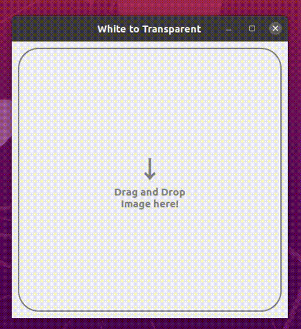
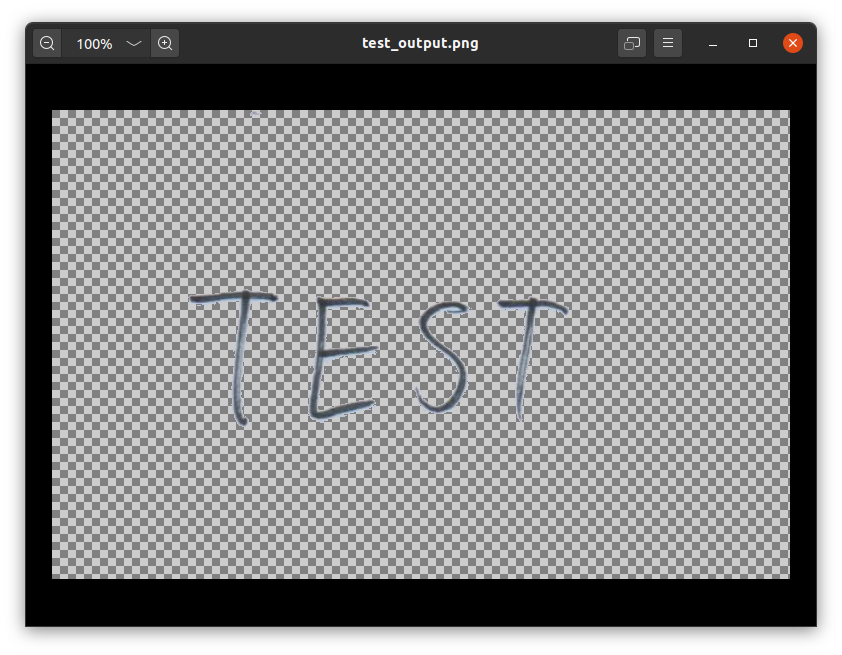

# white-to-transparent


This is a PyQt5-based script that converts white to transparent.

This is useful when archiving scanned **signature image**.


If you use it, **please do not put large images!** 

Large images can be a little messy.

---
### Usage

```bash
python3 white2transparent.py
```
When you run the script, a GUI window appears.

You can drag and drop the image, and use the slider to adjust the degree to make the white color transparent. 

##### GUI demo


##### Output 


